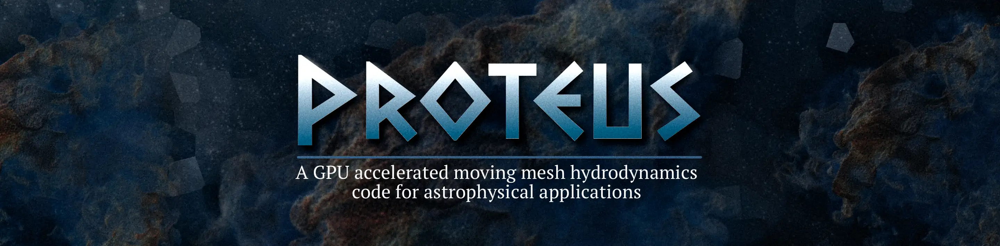
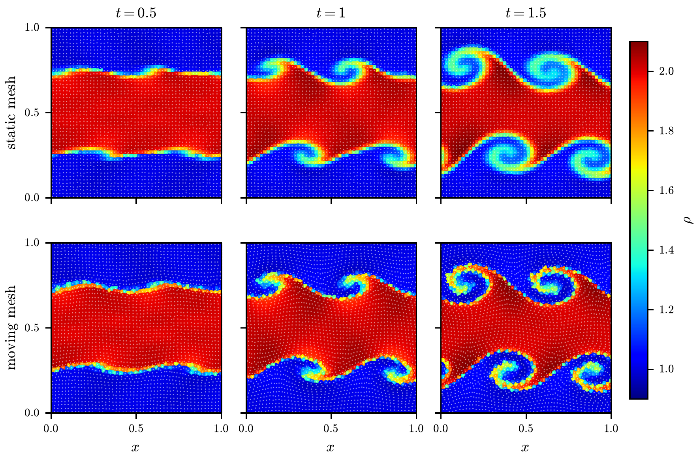
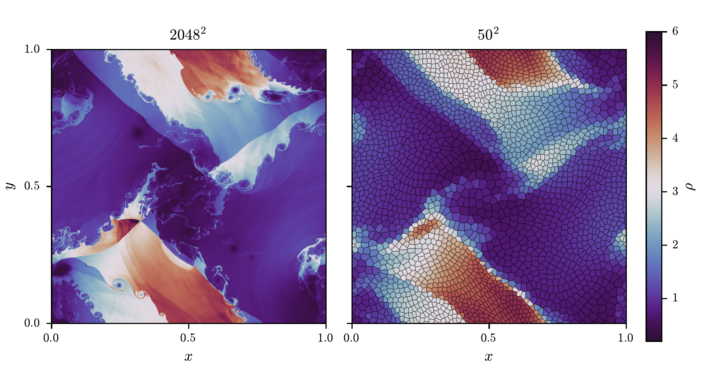
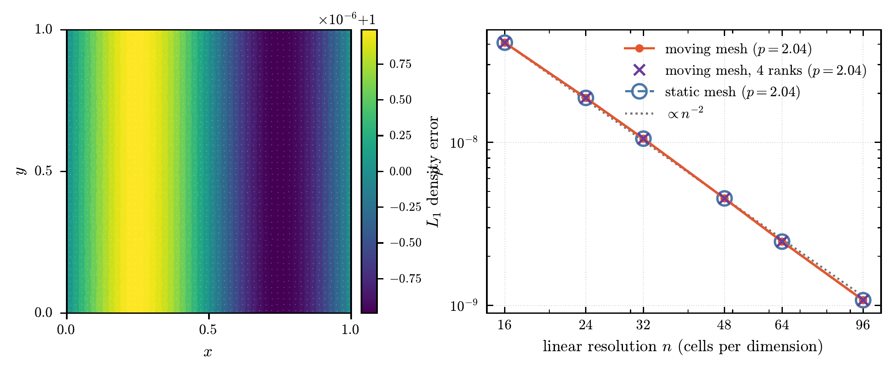
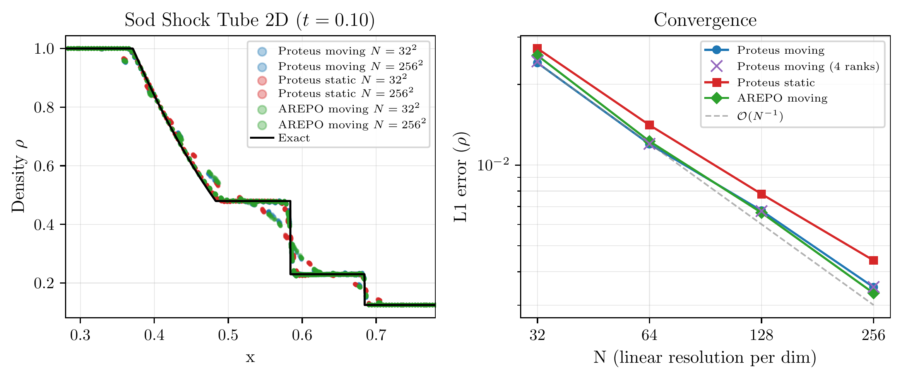
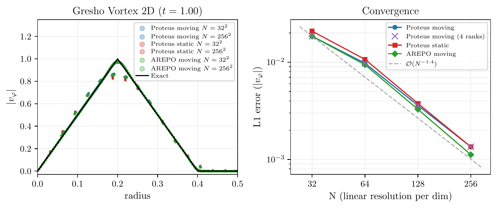
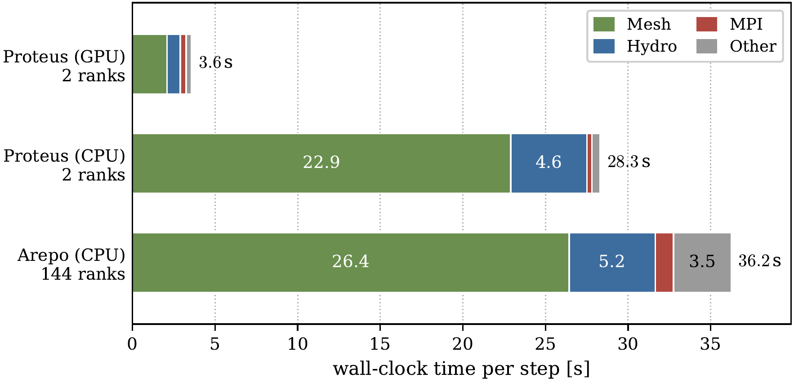
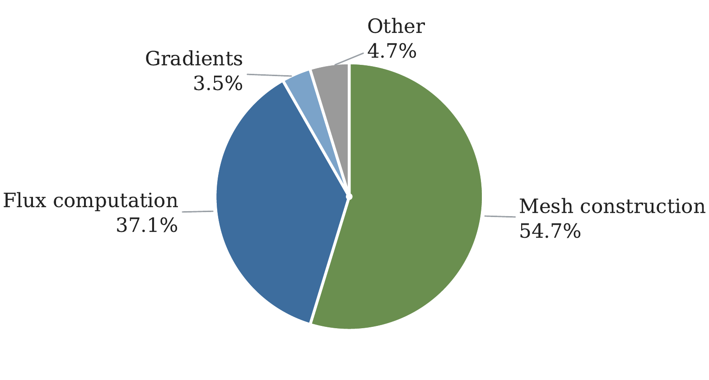
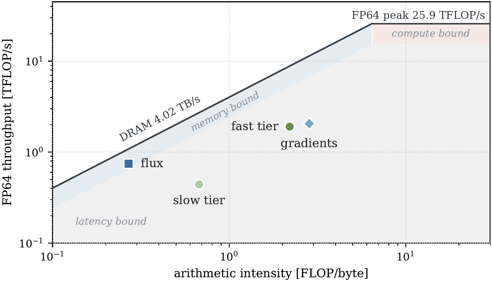
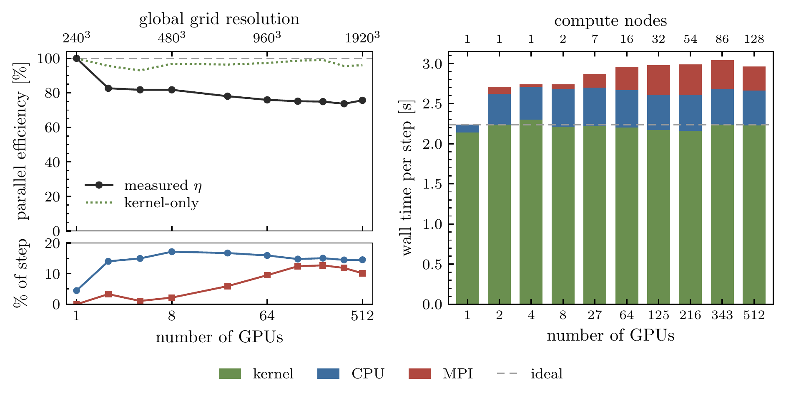

# Proteus

[](https://github.com/lucas56098/ProteusGPU/actions/workflows/build.yml) [](https://github.com/lucas56098/ProteusGPU/releases)



PROTEUS is a multi-node GPU-native moving mesh hydrodynamics code.

It combines the mesh generation of [[Ray et. al 2018]](https://doi.org/10.1145/3272127.3275092) with a moving mesh hydro solver similar to ["AREPO" [Springel 2010]](https://academic.oup.com/mnras/article/401/2/791/1147356) and is optimized for unified memory architectures like NVIDIA's GH200 chips targeting exascale astrophysical applications.

PROTEUS supports 2D/3D static/moving mesh generation on CPU and GPU (both unified and discrete memory) and is parallelized using an OpenMP + MPI hybrid (GPU-aware).

Additionally to the pure hydro solver there is support for static potential gravity, radiative cooling, a stellar feedback subgrid model as well as a chaotic cold accretion AGN model with thermal and kinetic mode feedback.

> [!NOTE]
> The current version is still under active development, so expect rapid changes. Proper documentation will follow eventually.


This project started during my master's thesis, supervised by [Dylan Nelson](https://nelson.tng-project.org/), at the Institute of Theoretical Astrophysics, Heidelberg University.

---

## Contents

- [Examples](#examples)
    - [Convergence](#convergence)
    - [Performance](#performance)
    - [Multi-node scaling](#multi-node-scaling)
- [Getting started](#getting-started)
- [Roadmap](#roadmap)

---
## Examples 

A $50^2$ Kelvin-Helmholtz instability on static and moving meshes.<br>


2D Riemann problem as in [[Kurganov and Tadmor, 2002]](https://www.semanticscholar.org/paper/Solution-of-two%E2%80%90dimensional-Riemann-problems-for-Kurganov-Tadmor/a44da75f9a36ab879fb9073f2571801eb7bc74a3)<br>


Volume rendering of AGN-feedback in an idealized Perseus-like cool-core cluster. Shown is the velocity magnitude with cool gas ($T < 5\times10^4 K$) overlaid in blue.<br>


### Convergence

Acoustic wave test showing second order convergence:<br>


Sod shock tube test showing error relative to AREPO:<br>


Gresho vortex test:<br>


### Performance

Per step time for a $454^3$ acoustic wave test on two GH200 chips:<br>


Breakdown of where the per step time is spent:<br>


Roofline plot for the major Kernels. Fast and slow-tier are part of the two-tier mesh generation.<br>


### Multi-node scaling

Weak scaling on JUWELS booster for an acoustic wave test with up to $1920^3$ and $512$ A$100$ GPUs.<br>


---
## Getting started

Dependencies: HDF5, CUDA (for GPU mode)

1. After cloning the repo select your system in `Makefile.systype` (or add your own to the `Makefile`)
2. Configure compilation flags in a `Config.sh` and build with
```bash
make CONFIG=/path/to/Config.sh BUILD_DIR=/path/to/build/ EXEC=/path/to/ProteusGPU
```
3. Use a `create.py` script for IC generation and specify simulation parameters in a `param.txt`
4. Run the simulation with
```bash
./ProteusGPU [./ics/param.txt] [restart_flag]
```
or using MPI with `mpirun`. If the `restart_flag` is set, the simulation continues from the last snapshot in the `output_folder`.

---

## Roadmap

* <span style = 'color:green'>v0.1 - kNN and Voronoi mesh construction (2D and 3D, CPU)</span>
* <span style = 'color:green'>v0.2 - first order FV hydro (static mesh, 2D and 3D, CPU)</span>
* <span style = 'color:green'>v0.3 - second order FV hydro (static mesh, 2D and 3D, CPU)</span>
* <span style = 'color:green'>v0.4 - moving mesh hydro (2D, CPU)</span>
* <span style = 'color:green'>v0.5 - moving mesh hydro (3D, CPU)</span>
* <span style = 'color:green'>v0.6 - GPU initial port (moving mesh hydro)</span>
* <span style = 'color:green'>v0.7 - single GPU optimization</span>
* <span style = 'color:green'>v0.8 - multi-GPU (distributed memory, MPI)</span>
* v0.9 - multi-GPU optimization
* v1.0 - support for inhomogenous particle distributions

additionally we plan to add more physics modules